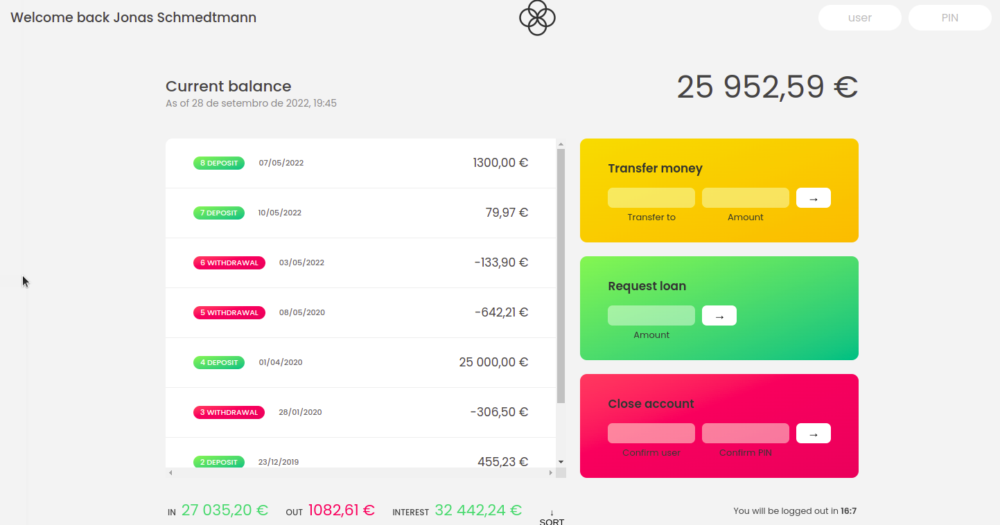

# bankist

   1. A wallet system app where you can login into your account, check your balance, check the account movement summary, transfer money, take out a loan , close your account , check the deposit, withdrawal , interest summary. Technologies used to make this app work are: Javascript, Internationalization API,  Web APIs like setInterval, DOM api like addEventListener()
     
   2. This app works only because of the functionality added by Javascript. It uses Internationalization API which is used for language sensitive string comparison, number formatting, date and time formatting. Other than this it uses web APIs like setInterval for the timer functionality. Dom APIs like addEventListeners() to add events on the buttons so as to perform certain actions based on the button clicked. Basically manipulating Javascript logic and code here and there and using functionality provided by the browser runtime environment made this project reach its completion. 

3. You can run this application on this link: https://dexterarmy.github.io/bankist/

4. You can only use two username and passwords in this app: a) usernname: js , password: 1111  b) username: jd , password: 2222

5. In this app when you close your account, the object which has all the information of the user gets deleted from the array which is in script.js file. So if you want to access the close account functionality then add the one of these object again in the script.js file so that you can use the app again: 
const account1 = {
  owner: 'Jonas Schmedtmann',
  movements: [200, 455.23, -306.5, 25000, -642.21, -133.9, 79.97, 1300],
  interestRate: 1.2, // %
  pin: 1111,

  movementsDates: [
    '2019-11-18T21:31:17.178Z',
    '2019-12-23T07:42:02.383Z',
    '2020-01-28T09:15:04.904Z',
    '2020-04-01T10:17:24.185Z',
    '2020-05-08T14:11:59.604Z',
    '2022-05-03T17:01:17.194Z',
    '2022-05-09T23:36:17.929Z',
    '2022-05-07T10:51:36.790Z',
  ],
  currency: 'EUR',
  locale: 'pt-PT', // de-DE
};

const account2 = {
  owner: 'Jessica Davis',
  movements: [5000, 3400, -150, -790, -3210, -1000, 8500, -30],
  interestRate: 1.5,
  pin: 2222,

  movementsDates: [
    '2019-11-01T13:15:33.035Z',
    '2019-11-30T09:48:16.867Z',
    '2019-12-25T06:04:23.907Z',
    '2020-01-25T14:18:46.235Z',
    '2020-02-05T16:33:06.386Z',
    '2020-04-10T14:43:26.374Z',
    '2020-06-25T18:49:59.371Z',
    '2020-07-26T12:01:20.894Z',
  ],
  currency: 'USD',
  locale: 'en-US',
};
